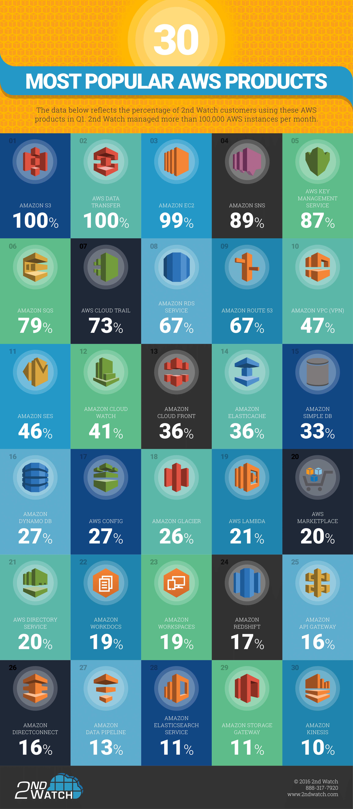

# Most Popular AWS Services

---

If you are new to Amazon AWS, and looking at their offerings, it can be a bit confusing, as they have a lot of services.

## What are the most popular AWS Services?

After search the internet, I didn't find official reports, e.g. based on AWS services usage statistics, from Amazon. However, there are a lot of people asking the same question. Hence a lot of posts discussing this with variant answers. See the long list in **Resources** section at the bottom where the answers range from 2014 to 2019.

By reading these posts, you may notice some of the answers may reflect authors' personal preferences, while others are based on real numbers, e.g. below figure is copied from [Top 30 AWS cloud services](https://www.networkworld.com/article/3074508/top-30-aws-cloud-services.html) by [2nd Watch](https://www.2ndwatch.com), an Amazon Web Services consultancy.

The figure reflects the percentage of 2nd Watch customers using AWS products in 2016 Q1. According to 2nd Watch, they managed more than 100,000 AWS instances per month. The figure shows that most of the environments 2nd Watch examined were using Amazon S3 (*100%*), EC2 (*99%*), SNS (*89%*), etc.

Though this report is a bit old as things are getting changed fast, below is a table that I created based on these posts I read. In this table, each row represents one AWS service with its category and a score. The score calculation is very simple, which is the occurence of the service mentioned in these posts. Multiple mentions of the same service in the same post will be treated as one score.

| AWS Service                 |Category                         | Score
|-----------------------------|---------------------------------|-------
| EC2                         | Compute                         | 16
| S3                          | Storage                         | 16
| RDS                         | Database                        | 13
| Route 53                    | Networking & Content Delivery   | 10
| Lambda                      | Compute                         | 8
| CloudFront                  | Networking & Content Delivery   | 8
| VPC                         | Networking & Content Delivery   | 8
| Simple Notification Service | Application Integration         | 8
| DynamoDB                    | Database                        | 7
| ELB                         | Compute                         | 6
| CloudWatch                  | Management & Governance         | 6
| Elastic Beanstalk           | Compute                         | 5
| EBS                         | Storage                         | 4
| Redshift                    | Database                        | 4
| ElastiCache                 | Database                        | 4
| AWS Auto Scaling            | Management & Governance         | 4
| CloudTrail                  | Management & Governance         | 4
| Simple Queue Service        | Application Integration         | 4
| IAM                         | Security, Identity & Compliance | 3
| S3 Glacier                  | Storage                         | 2
| CodeBuild                   | Developer Tools                 | 2
| Key Management Service      | Security, Identity & Compliance | 2
| Simple Email Service        | Customer Engagement             | 2
| Lightsail                   | Compute                         | 1
| EFS                         | Storage                         | 1
| Storage Gateway             | Storage                         | 1
| CodeStar                    | Developer Tools                 | 1
| CloudFormation              | Management & Governance         | 1
| Lex                         | Machine Learning                | 1

Not surprisingly, we can see from the table that the *4* AWS core products: *compute*, *storage*, *database*, and *networking*, lead the pack. Most services in the top list fall into these *4* categories. Some of the top items in 2nd Watch's report still remain as top items in this table, e.g. EC2, S3, RDS, Route 53, SNS, etc. Other items are getting more attractions in recent years, e.g. Lambda, CloudFront, VPC, DynamoDB, Elastic Beanstalk, etc.

## Resources

* [Top 10 AWS services to choose for your business in 2020](https://www.romexsoft.com/blog/top-10-aws-services/), 2019
* [Top 10 AWS services you should know about (2019 Edition)](https://www.clickittech.com/aws/top-10-aws-services/), 2019
* [Which AWS services are most used by enterprises all around the world?](https://www.quora.com/Which-AWS-services-are-most-used-by-enterprises-all-around-the-world), 2018 - 2019
* [What are the top 10 most used AWS services?](https://www.quora.com/What-are-the-top-10-most-used-AWS-services), 2017 - 2019
* [The 7 Most Popular AWS APIs](https://www.stratoscale.com/blog/cloud/7-popular-aws-apis/), 2017
* [10 Most Popular Amazon AWS Storage and Database Services](https://www.thegeekstuff.com/2016/02/aws-storage-and-db/), 2016
* [Top 30 AWS cloud services](https://www.networkworld.com/article/3074508/top-30-aws-cloud-services.html), 2016
* [The Three Most Widely Used Amazon Web Services](http://techgenix.com/three-most-widely-used-amazon-web-services/), 2014
