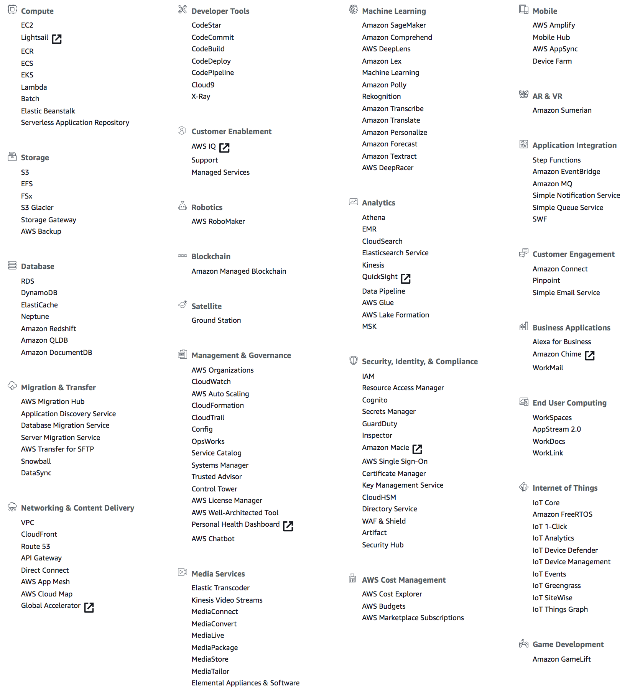

# The Number of AWS Services

---

As a comprehensive, evolving cloud computing platform, it is always a moving target for the number of AWS services because it was being increased dramatically in the past years.

## How many AWS Services are there?

As of the current date (Nov 2019), there are currently *147* top level services spread across *24* categories, spanning a wide range including computing, storage, networking, database, administration and security, analytics, application services, deployment, management, mobile, developer tools, tools for Internet of Things and more. Many of these top level services can further be expanded to multiple sub services, e.g. ESB, ELB, etc.

You can see all the services by logging into the AWS Console. Here is a snapshot that I took on my console:

## Resources

* [How many AWS services are there?](https://www.quora.com/How-many-AWS-services-are-there)
* [AWS Services List](https://www.parkmycloud.com/aws-services-list/)