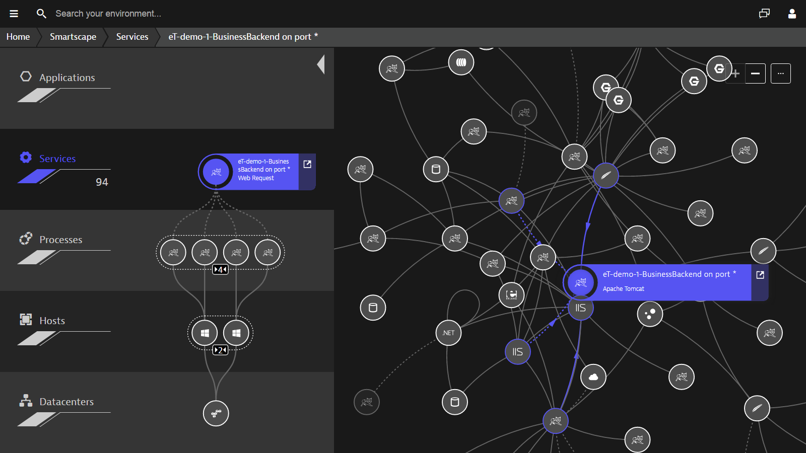
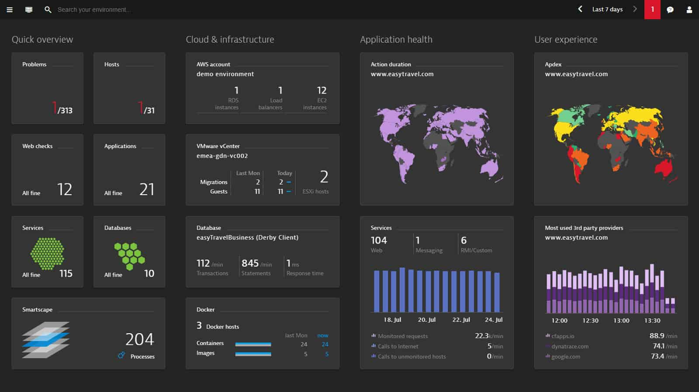

# Dynatrace

---

## Introduction

Dynatrace is available as on-premises installation or SaaS package. Machine learning is a feature that separates it from other run-of-the-mill monitoring products. It can use machine learning to monitor AWS services and detect abnormal behavior.

Also, Dynatrace is actually affiliated with AWS as an AWS APN Advanced Technology Partner. Hence, its use of machine learning and close partnership with Amazon make it one of the most natural solutions for AWS monitoring.

## Feature Highlights

* **All-in-one**: APM, cloud infrastructure, digital experience (Synthetic, RUM, Session Replay) for hybrid multi-cloud.
* **Single agent**: across every platform to monitor your full stack, different from some other monitoring tools that require multiple agents.
* **Fully automated**: Deployment/updates, discovery, baselining, problem ID, root cause.
* **Deterministic AI**: Get to the true root cause.
* **Designed for massive scale**: 100,000+ hosts per cluster, designed for microservice architectures.

## Auto-discover Application Stack

Automatically discover the full-stack of your application end-to-end from datacenters, to hosts, then processes, services, and applications, figure out the details of your elastic cloud environment updates on the launch and termination of instances, identify and map out the millions of dependencies among applications, services, and AWS resources in an interactive visual display, keep it dynamically updated.

No config, no hassle, no maintainence, because everything is continuously detected in real-time.

## Auto-detect Anomalies

With deep integration of Amazon CloudWatch into AI engine, it applies AI and big data analytics, learns how your application components work together, what constitutes normal behavior, and automatically detect anomalies without need to verify baseline metrics, config manual threshold, or adjust static alert settings.

As the tool learns how application components communicate with each other, you get an in-depth view of everything that's going on, it can detect problems, prioritize anomalies, identify reasons for issues in seconds, and recommend solutions to the root cause, so that reduces the time-to-problem-resolution.

Because it understands the dependencies within your environment, it doesn’t just alert you that there is an issue (describe the symptoms), it tells you why and where the performance problem lies (pinpoint the root cause).

Dynatrace is the only APM vendor giving complete insight into AWS and everything running on it.

## Resources

* [10 Minute Dynatrace Demo](https://www.youtube.com/watch?v=Mx0HbF0UgNc)
* [Dynatrace Demo - 5 minute getting started overview](https://www.youtube.com/watch?v=0ihCziAJ07U)
* [Dynatrace Demo - 5 minute show floor demo of Dynatrace at AWS Summit Sydney](https://www.youtube.com/watch?v=CSf89W2iNJQ)
* [Dynatrace: Voice Enabled Monitoring with Alexa and AWS](https://www.youtube.com/watch?v=ghuFQTCer7I)
* [Dynatrace AWS monitoring](https://www.dynatrace.com/technologies/aws-monitoring/)
* [A few reasons why companies choose Dynatrace AWS monitoring over the competition](https://www.dynatrace.com/technologies/aws-monitoring/appdynamics-new-relic-aws-compare/)
* [Amazon CloudWatch vs Dynatrace Application Monitoring](https://www.trustradius.com/compare-products/amazon-cloudwatch-vs-dynatrace-application-monitoring)
