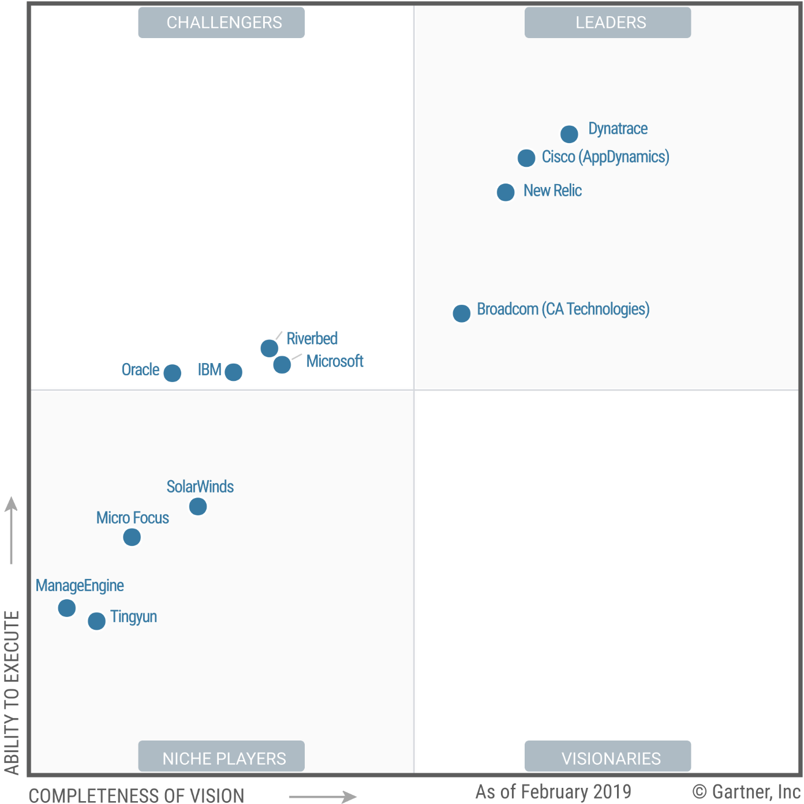
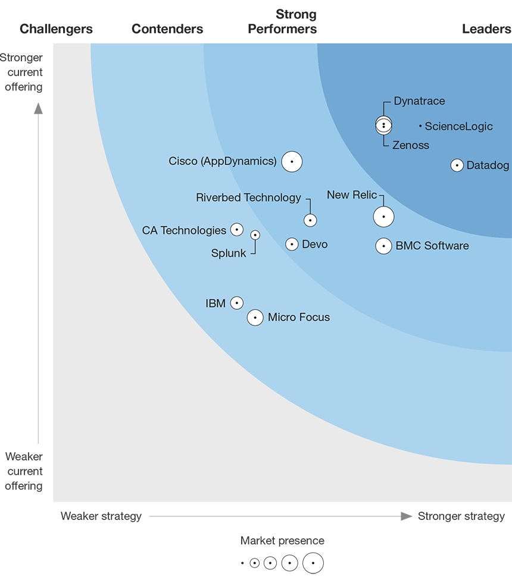

# Other Solutions

---

There are a handful of recommended tools for AWS monitoring other than CloudWatch. Most tools rely on CloudWatch, the native montoring service provided by Amazon. While in some cases CloudWatch is limited by itself, other tools can add additional values on top that you can't get from CloudWatch, e.g. monitoring applications or services running inside your EC2 instances which CloudWatch doesn’t.

Below is an incompleted list of some monitoring tools that claim to support AWS monitoring that I've seen in the market.

| Product                                             | Description
|-----------------------------------------------------|-------------
| [Dynatrace](https://www.dynatrace.com/)             | The APM offering available as on-premises, managed service and SaaS that covers AWS cloud, all under the same common architecture, leverages real-time topology and AI algorithms, automatically detect anomalies, business impact and root cause across users, applications, and infrastructure with a single view for enterprise cloud ecosystems from hybrid to multi-cloud.
| [AppDynamics](https://www.appdynamics.com/)         | As part of Cisco since March 2017, offers both on-premises and SaaS-based APM solution with a common architecture across both deployment models. It has a full-stack performance monitoring solution for AWS to help customers accelerate their cloud migration and deliver enterprise-grade, end-to-end performance monitoring for applications on the AWS cloud.
| [NewRelic](https://newrelic.com/)                   | As SaaS-only APM solution, lets you see performance from end user experience, through servers, down to the line of application code, supports distributed tracing and deeper integration into AWS cloud, allows you to build, migrate, and deploy applications and infrastructure faster with AWS monitoring.
| [Datadog](https://www.datadoghq.com/)               | A SaaS solution that can monitor your entire AWS environment in one place. By installing agent, providing read-only IAM role credentials, choosing AWS services to pull metrics from, it can get in-depth view of everything going on in your system, correlate metrics, traces, logs to identify and resolve incidents across your stack.
| [Hosted Graphite](https://www.hostedgraphite.com/)  | The hosted [Graphite](https://github.com/graphite-project/) that can instantly view AWS metrics on curated dashboards by synchronizing CloudWatch data to your Hosted Graphite account, including pre-created dashboards for all major services with many added features, e.g. custom metrics, responsive graphs, team access. All can be automated and modified with APIs from sending annotations for events to controlling specific aggregation rules.
| [Site24x7](https://www.site24x7.com/)               | A full-stack SaaS-based monitoring solution for IT and DevOps, integrates with your AWS account seamlessly, lets you deploy AWS resources with confidence, supports both agent-based and agent-less solution for your AWS environment, provides application insight and log monitoring, all under one umbrella.
| [Loom Systems](https://www.loomsystems.com/)        | An AIOps solution to predict and solve IT incidents for enterprise moving towards cloud such as AWS, leverage AI analytics to correlate issues across your entire AWS environment, proactively provides the actual root-cause in real-time, enriches the detected incidents with recommended resolutions and actions in plain English.
| [Unigma](https://unigma.com/)                       | A unified agent-less SaaS-based cloud management system that allows you to view and correlate metrics from multiple cloud infrastructures including AWS in a single pane of glass, to gain visibility into performance metrics and correlate alerts, and easing up the troubleshooting process.

Among them, Dynatrace, New Relic, and AppDynamics are leaders identified by [Gartner Magic Quadrant for Application Performance Monitoring](https://www.gartner.com/en/documents/3904665/magic-quadrant-for-application-performance-monitoring), published on March 14, 2019, because of their completeness of vision and highest for ability to execute.

Also, Datadog, along with Dynatrace are leaders identified by [The Forrester Wave™: Intelligent Application And Service Monitoring, Q2 2019](https://services.forrester.com/report/The+Forrester+Wave+Intelligent+Application+And+Service+Monitoring+Q2+2019/-/E-RES144386), published on April 18, 2019, which is more focusing on intelligent monitoring.

## Resources

* [Dynatrace AWS monitoring](https://www.dynatrace.com/technologies/aws-monitoring/)
* [AppDynamics AWS Monitoring](https://www.appdynamics.com/cloud-monitoring/aws-monitoring)
* [Performance monitoring for AWS](https://newrelic.com/partner/aws-monitoring)
* [Datadog: Monitor your entire AWS environment in one place](https://www.datadoghq.com/aws-monitoring/)
* [Amazon CloudWatch Monitoring with Hosted Graphite](https://www.hostedgraphite.com/AWS-cloudwatch)
* [Site24x7: The full-stack monitoring platform that lets you deploy AWS resources with confidence](https://www.site24x7.com/aws-monitoring.html)
* [Loom: AWS Log Monitoring Powered by AI](https://www.loomsystems.com/aws-monitoring-powered-by-ai)
* [Unigma: AWS Cloud Monitoring](https://unigma.com/aws-monitoring/)
* [11 Best Amazon Web Services (AWS) Monitoring Services](https://www.comparitech.com/net-admin/aws-monitoring-services/)
